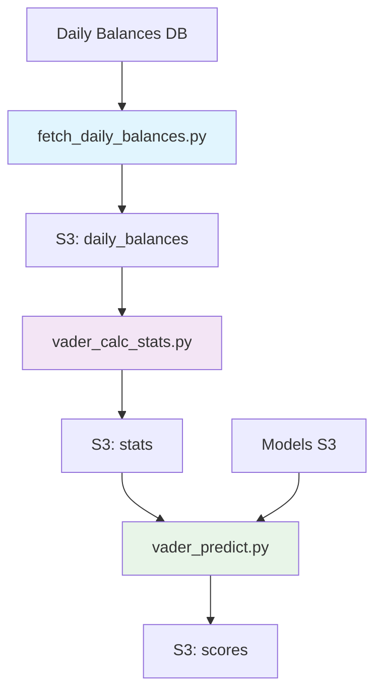

# Databricks Job Tasks - 仕様・運用ガイド

## 📋 概要

本ディレクトリには、Vader信用スコア算出パイプラインを構成する3つのDatabricks Jobタスクスクリプトが含まれています。これらのスクリプトは順次実行され、日次の口座残高データから最終的な信用スコアを算出します。

## 🔄 処理フロー



## 📁 タスクスクリプト一覧

| スクリプト | 役割 | 入力 | 出力 | 実行順序 |
|-----------|------|------|------|----------|
| `fetch_daily_balances.py` | 日次残高データ取得 | Databricks DB | S3: daily_balances | 1 |
| `vader_calc_stats.py` | 統計値計算 | S3: daily_balances | S3: stats | 2 |
| `vader_predict.py` | 信用スコア予測 | S3: stats, models | S3: scores | 3 |

---

## 🎯 1. fetch_daily_balances.py

### 目的
Databricksデータベースから日次口座残高データを取得し、S3に保存します。

### 実行モード
```bash
# Sequential（デフォルト）
python fetch_daily_balances.py [table_type] [pandas_version] sequential

# Parallel（並列処理）
python fetch_daily_balances.py [table_type] [pandas_version] parallel

# Spark（分散処理）
python fetch_daily_balances.py [table_type] [pandas_version] spark
```

### 引数
- `environment`: 実行環境（prod/test/sandbox）
- `is_daily_balances_v2`: v2テーブル使用フラグ（true/false）
- `mode`: 実行モード（sequential/parallel/spark）

### 実行例
```bash
# 本番環境、v2テーブル使用、Spark mode
python fetch_daily_balances.py prod true spark

# テスト環境、v1テーブル使用、Parallel mode
python fetch_daily_balances.py test false parallel

# サンドボックス環境、v2テーブル使用、Sequential mode
python fetch_daily_balances.py sandbox true sequential
```

### データソース
- **Vader用**: `mfhc_databricks_prod.`zz-mfw-credit-scoring`.daily_balances_filtered_for_vader` (datapoint>=5でフィルタ済み)
- **Obi-Wan用**: `mfhc_databricks_prod.`zz-mfw-credit-scoring`.daily_balances_v2` (最新版テーブル)
- **Original用**: `mfhc_databricks_prod.`zz-mfw-credit-scoring`.daily_balances` (フィルタなし、obi-wan特徴量計算用)

### 処理フロー
1. **daily_balances_v2環境の場合**:
   - obi-wan.daily_balances + obi-wan.daily_balance_infoを出力
2. **vader環境の場合**:
   - vader.daily_balances + vader.daily_balance_info（フィルタ済み）を出力
   - vader.daily_balances_original + vader.daily_balance_info_original（フィルタなし）を出力

### Infoファイルの内容
```json
{
  "last_month_year": {
    "year": 2024,
    "month": 12
  },
  "processed_at": "2024-12-20"
}
```

### 出力先
#### DataFrame（pickle形式）
- **vader.daily_balances**: `s3://bucket/data/vader.daily_balances/[date]/[office_id].pkl` (datapoint>=5でフィルタ済み)
- **vader.daily_balances_original**: `s3://bucket/data/vader.daily_balances_original/[date]/[office_id].pkl` (フィルタなし)
- **obi-wan.daily_balances**: `s3://bucket/data/obi-wan.daily_balances/[date]/[office_id].pkl` (daily_balances_v2)

#### Info（JSON形式）
- **vader.daily_balance_info**: `s3://bucket/data/vader.daily_balance_info/[date]/[office_id].json`
- **vader.daily_balance_info_original**: `s3://bucket/data/vader.daily_balance_info_original/[date]/[office_id].json`
- **obi-wan.daily_balance_info**: `s3://bucket/data/obi-wan.daily_balance_info/[date]/[office_id].json`

#### Latest（最新版）
- **DataFrame**: `s3://bucket/data/[model].[type]/latest/[office_id].pkl`
- **Info**: `s3://bucket/data/[model].daily_balance_info/latest/[office_id].json`

---

## 📊 2. vader_calc_stats.py

### 目的
日次残高データから月次統計値を計算し、機械学習用の特徴量を生成します。

### 引数
- `environment`: 実行環境（prod/test/sandbox）
- `mode`: 実行モード（sequential/parallel/spark）

### 実行例
```bash
# 本番環境、Spark mode
python vader_calc_stats.py prod spark

# テスト環境、Parallel mode
python vader_calc_stats.py test parallel

# サンドボックス環境、Sequential mode
python vader_calc_stats.py sandbox sequential
```

### 処理内容
1. **月次集計**: 残高・差分残高の統計値計算
2. **時系列特徴量**: 過去12ヶ月のシフト特徴量
3. **累積特徴量**: 累積和・標準偏差の計算
4. **除外処理**: モデル入力範囲外データの除外

### 特徴量カテゴリ
- `monthly_*_balance`: 月次残高統計（平均、最大、最小、分位数等）
- `B[1-11]_monthly_*_balance`: 過去N月のシフト特徴量
- `cum_[2-12]_*`: 累積和特徴量
- `sd_[2-12]_*`: 標準偏差特徴量

### 入力元
- `s3://bucket/vader.daily_balances/[date]/[office_id].pkl`

### 出力先
- `s3://bucket/vader.stats/[date]/[office_id].pkl`

---

## 🤖 3. vader_predict.py

### 目的
統計値データを使用して機械学習モデルで信用スコアを予測します。

### 引数
- `environment`: 実行環境（prod/test/sandbox）
- `mode`: 実行モード（sequential/parallel/spark）

### 実行例
```bash
# 本番環境、Spark mode
python vader_predict.py prod spark

# テスト環境、Parallel mode
python vader_predict.py test parallel

# サンドボックス環境、Sequential mode
python vader_predict.py sandbox sequential
```

### 処理内容
1. **データ前処理**: 時系列変数除去、ラベルエンコーディング
2. **モデル予測**: 12種類のモデル（B1-B12）で予測実行
3. **スコア統合**: 各期間モデルの予測結果を統合

### モデル構成
- **B1-B12**: 過去1-12ヶ月の異なる期間長でトレーニングされたモデル
- **バージョン**: `2023_model_v72`

### 入力元
- **Stats**: `s3://bucket/vader.stats/[date]/[office_id].pkl`
- **Process Info**: `s3://bucket/vader.process_info/[date]/[office_id].json`
- **Models**: `s3://bucket/models/vader/m_BRF_B[0-11]_OutOfYear=2023_model_v72__Pro.pkl`

### 出力先
- **Scores**: `s3://bucket/vader.scores/[date]/[office_id].json`
- **Latest**: `s3://bucket/vader.scores/latest/[office_id].json`

---

## ⚙️ 実行モード詳細

### Sequential Mode
- **特徴**: 逐次処理、デバッグに適している
- **性能**: ベースライン（1倍）
- **メモリ**: 低
- **適用場面**: 小規模データ、開発・デバッグ

### Parallel Mode  
- **特徴**: ThreadPoolExecutorによる並列処理
- **性能**: 5-8倍高速化
- **メモリ**: 中（リソース共有）
- **適用場面**: 中規模データ、ローカル環境

### Spark Mode
- **特徴**: Sparkクラスターによる分散処理
- **性能**: 10-20倍高速化
- **メモリ**: 高（分散メモリ）
- **適用場面**: 大規模データ、本番環境

### パフォーマンス比較

| データ規模 | Sequential | Parallel | Spark |
|-----------|-----------|----------|-------|
| 1,000 office_ids | 2-3時間 | 20-40分 | 10-20分 |
| 5,000 office_ids | 10-15時間 | 2-3時間 | 30-60分 |

---

## 📊 監視・運用

### ログ出力
各スクリプトは以下の場所にログを出力：
- **S3ログ**: `s3://bucket/logs/databricks_jobs/[job_name]_[timestamp].json`
- **コンソール**: 進捗状況、エラー情報をリアルタイム出力

### 監視項目
1. **処理時間**: 各タスクの実行時間
2. **データ量**: 処理対象office_id数
3. **成功率**: 正常完了office_id比率
4. **エラー発生**: 例外・エラーの発生状況
5. **リソース使用**: CPU・メモリ使用率

```

## 📋 引数詳細

### 共通引数仕様
| 引数 | 位置 | 必須 | 説明 | 例 |
|------|------|------|------|-----|
| `environment` | sys.argv[1] | ○ | 実行環境 | prod/test/sandbox |
| `is_daily_balances_v2` | sys.argv[2] | ○ | v2テーブル使用フラグ | true/false |
| `mode` | sys.argv[3] | ○ | 実行モード | sequential/parallel/spark |

### 環境別設定
| 環境 | S3バケット | 用途 |
|------|------------|------|
| **prod** | mf-credit-scoring-prod | 本番環境 |
| **test** | mf-credit-scoring-test | テスト環境 |
| **sandbox** | mf-credit-scoring-sandbox | 開発環境 |

### 実行モード詳細
| モード | 説明 | 適用場面 |
|--------|------|----------|
| **sequential** | 逐次処理 | 開発・デバッグ時 |
| **parallel** | 並列処理（ThreadPoolExecutor） | 中規模データ処理 |
| **spark** | 分散処理（Spark） | 大規模データ処理 |

---

## 🔍 トラブルシューティング

### よくある問題と対処法

#### 1. メモリ不足エラー
```
OutOfMemoryError: Java heap space
```
**対処法**:
- Sparkモードを使用
- `spark.executor.memory`を増加
- バッチサイズを減少

#### 2. S3接続エラー
```
NoCredentialsError: Unable to locate credentials
```
**対処法**:
- AWS認証情報を確認
- IAMロール権限を確認
- S3バケット存在を確認

#### 3. モデル読み込みエラー
```
FileNotFoundError: Model file not found
```
**対処法**:
- モデルファイルの存在確認
- S3パス設定の確認
- モデルバージョンの確認

#### 4. 空データエラー
```
lack of datapoint: office_id = XXXXX
```
**対処法**:
- 上流データの確認
- データ期間設定の確認
- 除外条件の見直し

### エラー調査手順
1. **ログ確認**: S3ログファイルでエラー詳細を確認
2. **データ確認**: 入力データの存在・形式を確認
3. **設定確認**: 環境変数・設定値を確認
4. **リソース確認**: クラスターリソースを確認
5. **段階実行**: Sequentialモードでデバッグ実行

---

## 🚀 パフォーマンス最適化

### 実行モード選択指針
```python
def select_optimal_mode(office_count, cluster_size):
    if office_count < 100:
        return "sequential"  # デバッグ・小規模
    elif office_count < 1000:
        return "parallel"    # 中規模
    else:
        return "spark"       # 大規模・本番
```

### Spark最適化設定
```python
# パーティション最適化
optimal_partitions = min(120, office_count // 10)

# リソース最適化
executor_memory = f"{max(4, cluster_size * 2)}g"
executor_cores = min(4, cluster_size)

# キャッシュ最適化
spark.conf.set("spark.sql.adaptive.enabled", "true")
```

### バッチサイズ調整
```python
# メモリ使用量に応じた調整
BATCH_SIZES = {
    "fetch_daily_balances": 100,  # データ量大
    "vader_calc_stats": 50,       # CPU集約
    "vader_predict": 20           # メモリ集約
}
```
